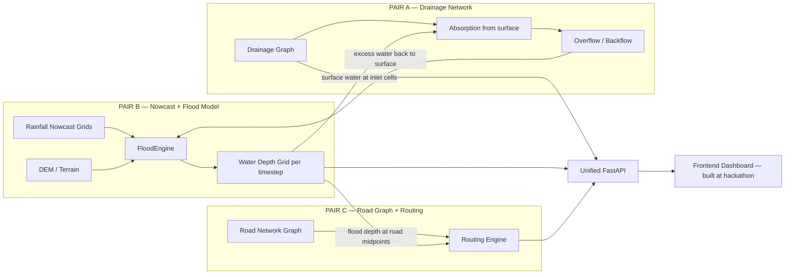

# URBAN FLOOD NOWCAST — Revised Team Assignment (3 Pairs)

> **Pre-hackathon**: Sep 1 – Sep 11 (11 working days)  
> **Hackathon**: Sep 12–13 (36 hours — frontend only)  
> **Team**: 6 developers in 3 pairs

---

## Team Structure

```
┌─────────────────────────────────────────────────────────────────────┐
│                     PRE-HACKATHON  (Sep 1–11)                       │
│                                                                     │
│   PAIR A (2 devs)          PAIR B (2 devs)        PAIR C (2 devs)  │
│   ─────────────────        ─────────────────      ──────────────── │
│   DRAINAGE NETWORK         RAINFALL NOWCAST       ROAD GRAPH       │
│   + Data Collection        + FLOOD MODEL          + ROUTING ENGINE │
│   + Graph Model            + Data Collection      + Data Collection│
│   + Capacity/Overflow      + Simulation Engine     + A* Algorithm  │
│   + Drainage API           + Forecast API          + Route API     │
│                                                                     │
│                    ┌──────────────────────┐                         │
│                    │  INTEGRATION PHASE   │  ← All 6 devs (Sep 10) │
│                    │  APIs + Testing      │                         │
│                    └──────────────────────┘                         │
└─────────────────────────────────────────────────────────────────────┘

┌─────────────────────────────────────────────────────────────────────┐
│                     HACKATHON DAY  (Sep 12–13)                      │
│                     All 6 → FRONTEND TOGETHER                       │
└─────────────────────────────────────────────────────────────────────┘
```

---

## How the 3 Components Connect



> [!IMPORTANT]
> **The 3 pairs work independently but must agree on shared interfaces early (Sep 1–2).** The integration points are:
> 1. **Pair B → Pair A**: Flood engine calls `drainage.absorb_surface_water(depth_grid)` and receives overflow back
> 2. **Pair B → Pair C**: Flood engine provides `depth_grid` that routing engine uses to penalise flooded roads
> 3. **All pairs** expose their own FastAPI endpoints; DEV from each pair wires their router into the shared `main.py`

---

## Shared Contracts (agree on Day 1)

All 3 pairs must use the same:

```python
# Grid configuration (set once, used everywhere)
GRID_ROWS = 200
GRID_COLS = 200
CELL_SIZE_M = 10.0        # 10 m × 10 m cells → 2 km × 2 km city
ORIGIN_LAT = 19.0600      # SW corner of study area (Mumbai example)
ORIGIN_LON = 72.8500
CRS = "EPSG:4326"

# Time horizons (minutes from now)
FORECAST_HORIZONS = [0, 30, 60, 90, 120, 180]

# Simulation timestep
DT_SECONDS = 300           # 5-minute steps
```

### Interface: Pair B exposes to Pair A
```python
class FloodEngine:
    water_depth: np.ndarray          # shape (200, 200), values in meters
    cell_size: float                 # 10.0 m

    def get_depth_at_cell(self, row: int, col: int) -> float: ...
    def add_overflow_at_cell(self, row: int, col: int, volume_m3: float): ...
```

### Interface: Pair A exposes to Pair B
```python
class DrainageGraph:
    def absorb_surface_water(self, depth_grid: np.ndarray, dt: float) -> np.ndarray:
        """Returns absorption_grid: how much water (m) was removed from each cell."""

    def compute_overflow(self) -> dict[str, float]:
        """Returns {node_id: overflow_volume_m3} for nodes exceeding capacity."""

    def get_node_cell(self, node_id: str) -> tuple[int, int]:
        """Returns (row, col) of the DEM cell where this node sits."""
```

### Interface: Pair B exposes to Pair C
```python
class FloodEngine:
    def get_forecast_grids(self) -> dict[int, np.ndarray]:
        """Returns {minutes: depth_grid} for all forecast horizons."""
```

---

## PAIR A — Drainage Network (2 Developers)

### Who Does What

| Dev | Focus | Role Name |
|-----|-------|-----------|
| **A1** | Data collection + GeoJSON generation | Drainage Data Engineer |
| **A2** | Graph model + capacity + overflow logic + API | Drainage Model Engineer |

---

### A1 — Drainage Data Engineer

**Goal**: Collect or generate a realistic drainage network dataset for the target city

#### Data Sources to Explore

| Source | URL | What You Get |
|--------|-----|--------------|
| **OpenStreetMap** — drainage ways | `https://overpass-api.de/api/interpreter` | Storm drains, canals, culverts tagged as `man_made=drain`, `waterway=drain`, `tunnel=culvert` |
| **India WRIS** (Water Resources Info System) | `https://indiawris.gov.in` | River basin data, some urban drainage maps |
| **Municipal GIS portals** | Delhi: `https://data.gov.in` / Mumbai: `https://portal.mcgm.gov.in` | SWD (Storm Water Drain) layers if published |
| **Google Earth / Satellite** | Manual digitization | Trace visible open drains, nala channels |
| **SWMM sample networks** | `https://www.epa.gov/water-research/storm-water-management-model-swmm` | Reference pipe diameters, typical layouts |
| **Academic papers** | Search: "Mumbai storm water drainage GIS shapefile" | Often include network topology in supplementary data |

#### Overpass Query (run this to get drainage from OSM)
```
[out:json][timeout:180];
area["name"="Mumbai"]->.city;
(
  way["man_made"="drain"](area.city);
  way["waterway"="drain"](area.city);
  way["waterway"="canal"](area.city);
  way["tunnel"="culvert"](area.city);
  node["man_made"="manhole"](area.city);
  node["man_made"="drainage"](area.city);
);
out body geom;
```

#### Task Breakdown

| # | Task | Hours | Deadline |
|---|------|-------|----------|
| A1.1 | Run OSM Overpass query for target city, download raw data | 3 h | Sep 2 |
| A1.2 | Clean and filter: keep only storm-water relevant features, remove duplicates | 3 h | Sep 3 |
| A1.3 | If real data is sparse → generate synthetic drainage network: design topology of 50 nodes + 60 edges following real city street grid | 4 h | Sep 4 |
| A1.4 | Assign realistic attributes to each node: `type` (inlet/manhole/junction/pump/outlet), `capacity_m3s` (0.1–2.0), `elevation_m` (from DEM or estimated) | 3 h | Sep 5 |
| A1.5 | Assign realistic attributes to each edge: `diameter_m` (0.3–1.5), `slope` (0.001–0.01), `roughness_n` (0.013 concrete, 0.025 earth), `blockage_pct` (0–0.4) | 3 h | Sep 5 |
| A1.6 | Map each inlet node to a DEM grid cell (`grid_row`, `grid_col`) — coordinate with Pair B for DEM extent | 2 h | Sep 6 |
| A1.7 | Export as `drainage_nodes.geojson` and `drainage_edges.geojson` | 1 h | Sep 6 |
| A1.8 | Create validation plot: drainage network overlaid on DEM | 2 h | Sep 7 |
| A1.9 | Document data sources + methodology in `backend/data/drainage/README.md` | 1 h | Sep 7 |

**Total: ~22 hours**

#### Output Files
```
backend/data/drainage/
├── drainage_nodes.geojson     # FeatureCollection of Point features
├── drainage_edges.geojson     # FeatureCollection of LineString features
├── README.md                  # Data provenance documentation
└── raw/                       # Raw downloaded files (for reference)
    └── osm_drainage_mumbai.json
```

#### Node GeoJSON Schema
```json
{
  "type": "Feature",
  "properties": {
    "id": "DN-001",
    "type": "inlet",
    "elevation_m": 8.5,
    "capacity_m3s": 0.5,
    "grid_row": 45,
    "grid_col": 102
  },
  "geometry": {
    "type": "Point",
    "coordinates": [72.855, 19.068]
  }
}
```

#### Edge GeoJSON Schema
```json
{
  "type": "Feature",
  "properties": {
    "id": "DE-001",
    "from_node": "DN-001",
    "to_node": "DN-005",
    "length_m": 120,
    "diameter_m": 0.6,
    "slope": 0.005,
    "roughness_n": 0.013,
    "blockage_pct": 0.0
  },
  "geometry": {
    "type": "LineString",
    "coordinates": [[72.855, 19.068], [72.856, 19.069]]
  }
}
```

---

### A2 — Drainage Model Engineer

**Goal**: Build `DrainageGraph` class that loads the GeoJSON, simulates pipe flow, and computes overflow

#### Task Breakdown

| # | Task | Hours | Deadline |
|---|------|-------|----------|
| A2.1 | Implement `DrainageGraph.__init__()` and `load_from_geojson()` — build `networkx.DiGraph` from A1's GeoJSON files | 3 h | Sep 4 |
| A2.2 | Implement Manning's equation for pipe capacity: `Q = (1/n) × A × R^(2/3) × S^(1/2)` where A = π(D/2)², R = D/4 for full pipe | 2 h | Sep 5 |
| A2.3 | Implement `absorb_surface_water(depth_grid, dt)`: for each inlet node, compute `absorbed = min(depth_at_cell × cell_area, inlet_capacity × dt)`. Return absorption grid | 4 h | Sep 6 |
| A2.4 | Implement pipe flow propagation: topological sort of graph, propagate flow from upstream to downstream, accumulate at junctions | 4 h | Sep 7 |
| A2.5 | Implement `compute_overflow()`: `effective_cap = capacity × (1 - blockage_pct)`. If `current_flow > effective_cap` → overflow. Return dict of `{node_id: overflow_m3}` | 3 h | Sep 8 |
| A2.6 | Implement `set_blockage(edge_id, pct)` for Scenario 5 (40% blockage) | 1 h | Sep 8 |
| A2.7 | Implement `get_node(id)` and `get_edge(id)` returning full attribute dicts | 1 h | Sep 8 |
| A2.8 | Build FastAPI router `api/drainage.py`: `GET /api/drainage/{node_id}` returning node details + flow + capacity + overflow risk | 3 h | Sep 9 |
| A2.9 | Write unit tests: Manning capacity, overflow detection, blockage effect, topological flow | 4 h | Sep 10 |
| A2.10 | Integration test with Pair B: feed real depth grid → verify absorption + overflow cycle | 3 h | Sep 10 |

**Total: ~28 hours**

---

## PAIR B — Rainfall Nowcasting + Flood Model (2 Developers)

### Who Does What

| Dev | Focus | Role Name |
|-----|-------|-----------|
| **B1** | Rainfall data collection + nowcast provider | Rainfall Data Engineer |
| **B2** | Flood simulation engine (FloodEngine + surface flow) + DEM | Flood Simulation Engineer |

---

### B1 — Rainfall Data Engineer

**Goal**: Collect real rainfall data and build the `RainfallProvider` with demo + live modes

#### Data Sources

| Source | URL | Format | Resolution | Latency |
|--------|-----|--------|------------|---------|
| **NASA GPM IMERG** (Near Real-Time) | `https://gpm.nasa.gov/data/imerg` → use `https://gpm1.gesdisc.eosdis.nasa.gov/data/GPM_L3/GPM_3IMERGHH.07/` | HDF5 / NetCDF4 | 0.1° (~10 km), 30 min | ~4 hours |
| **IMD Doppler Radar** | `https://mausam.imd.gov.in/imd_latest/contents/radar.php` | PNG images (need scraping) or contact IMD for data access | ~1 km, 10 min | Near real-time |
| **OpenWeatherMap** (free tier) | `https://openweathermap.org/api/one-call-3` (API key needed) | JSON | Point-based | Real-time |
| **Tomorrow.io** (free tier) | `https://www.tomorrow.io/weather-api/` | JSON | 1 km | Real-time |
| **AWS NEXRAD (US radars, for reference)** | `s3://noaa-nexrad-level2/` | Level-II radar | 1 km, 5 min | Real-time |
| **Mausam.imd.gov.in AWS radar** | `https://mausam.imd.gov.in/imd_latest/contents/aws.php` | Station-level rain gauge | Point | ~1 hour |
| **India Meteorological Dept historical** | `https://www.imdpune.gov.in/cmpg/Griddata/Rainfall_25_Bin.html` | Gridded 0.25° daily | 25 km, daily | Historical |
| **CHIRPS Rainfall** | `https://data.chc.ucsb.edu/products/CHIRPS-2.0/` | GeoTIFF | 0.05°, daily | ~1 day lag |

> [!TIP]
> **For hackathon demo**: Pre-download 2-3 heavy rainfall events for Mumbai (e.g., July 2023 monsoon) from IMERG. Use those as realistic "live" inputs. Build 5 synthetic scenarios on top.

#### Task Breakdown

| # | Task | Hours | Deadline |
|---|------|-------|----------|
| B1.1 | Register for NASA Earthdata account (`https://urs.earthdata.nasa.gov/`), download sample IMERG HDF5 files for Mumbai region | 3 h | Sep 2 |
| B1.2 | Write parser: read IMERG HDF5 → extract `precipitationCal` variable → clip to study area → resample to 200×200 grid | 4 h | Sep 3 |
| B1.3 | Define `RainfallProvider` abstract base class with methods: `get_current_rainfall()`, `get_radar_frames()`, `generate_nowcast(scenario, horizon)` | 2 h | Sep 3 |
| B1.4 | Implement `DemoRainfallProvider` — generates deterministic synthetic grids | 2 h | Sep 4 |
| B1.5 | Create **Scenario 1: Moderate Rain** — uniform 10 mm/hr across grid, 2 hr duration, linear ramp-up/ramp-down | 2 h | Sep 4 |
| B1.6 | Create **Scenario 2: Heavy Rain** — 30 mm/hr peak, Gaussian spatial bell centered on low-elevation area, 1.5 hr duration | 2 h | Sep 5 |
| B1.7 | Create **Scenario 3: Extreme Rainstorm** — 60 mm/hr, moving rain cell (travels NW→SE at 20 km/hr), 1 hr | 3 h | Sep 5 |
| B1.8 | Create **Scenario 4: Cloudburst** — 120 mm/hr, very localized (500 m radius), 30-min burst then stops | 2 h | Sep 6 |
| B1.9 | Create **Scenario 5: Extreme + 40% Drainage Blockage** — same rainfall as Scenario 3, but sets a flag that Pair A reads to apply 40% blockage | 1 h | Sep 6 |
| B1.10 | Each scenario must produce grids at: NOW, +30, +60, +90, +120, +180 min (temporal evolution — rain intensity changes over time) | 3 h | Sep 7 |
| B1.11 | Implement `LiveRainfallProvider` stub: fetch from OpenWeatherMap or Tomorrow.io free API, parse JSON, interpolate to grid, fallback to demo mode on error | 4 h | Sep 8 |
| B1.12 | Document all data sources and how to obtain them in `backend/data/rainfall/SOURCES.md` | 2 h | Sep 8 |
| B1.13 | Write unit tests: grid shapes, value ranges, temporal monotonicity for ramp scenarios | 2 h | Sep 9 |

**Total: ~32 hours**

#### Output Format
```python
provider = DemoRainfallProvider(grid_shape=(200, 200), cell_size=10.0)
forecast = provider.generate_nowcast(scenario="cloudburst", horizon_minutes=180)

# Returns:
# {
#     0:   np.array((200, 200)),    # mm/hr at T+0
#     30:  np.array((200, 200)),    # mm/hr at T+30 min
#     60:  np.array((200, 200)),    # mm/hr at T+60 min
#     90:  np.array((200, 200)),    # mm/hr at T+90 min
#     120: np.array((200, 200)),    # mm/hr at T+120 min
#     180: np.array((200, 200)),    # mm/hr at T+180 min
# }
```

---

### B2 — Flood Simulation Engineer

**Goal**: Build `FloodEngine` + DEM generation + surface flow routing. This is the computational core.

#### Task Breakdown

| # | Task | Hours | Deadline |
|---|------|-------|----------|
| B2.1 | Generate synthetic DEM (200×200, 10 m cells): terrain with a central ridge, two valleys draining to east and west, flat urban core, a low-lying flood-prone zone in SE corner | 4 h | Sep 2 |
| B2.2 | Generate imperviousness grid (same shape): roads = 0.95, commercial = 0.9, residential = 0.7, parks = 0.3, water bodies = 0.0 | 2 h | Sep 3 |
| B2.3 | Generate infiltration rate grid: `infiltration = base_rate × (1 - imperviousness)`, base_rate = 5 mm/hr | 1 h | Sep 3 |
| B2.4 | Implement D8 flow direction computation: for each cell, find lowest of 8 neighbors, store direction index | 4 h | Sep 4 |
| B2.5 | Implement `FloodEngine.__init__(dem, rainfall_provider, drainage_graph)`: store grids, allocate `water_depth` array (zeros) | 2 h | Sep 4 |
| B2.6 | Implement `initialize()`: compute flow directions, identify sink cells (local minima — potential ponding areas) | 2 h | Sep 5 |
| B2.7 | Implement `apply_rainfall(dt)`: per cell `water_depth += max(rain_rate × dt/3600 - infiltration × dt/3600, 0) / 1000` (mm → m) | 2 h | Sep 5 |
| B2.8 | Implement `calculate_surface_flow()`: redistribute water using D8 — vectorized NumPy. Multiple passes (3-5) per timestep for stability. Water moves proportional to slope, limited by available depth | 6 h | Sep 6 |
| B2.9 | Implement `calculate_drainage_absorption()`: call `drainage_graph.absorb_surface_water()`, subtract result from `water_depth` | 2 h | Sep 7 |
| B2.10 | Implement `calculate_overflow()`: call `drainage_graph.compute_overflow()`, add overflow volume back to surface cells | 2 h | Sep 7 |
| B2.11 | Implement `simulate_timestep(dt)`: call apply_rainfall → surface_flow → drainage_absorption → overflow in sequence | 1 h | Sep 7 |
| B2.12 | Implement `run_forecast(horizon_minutes=180, dt=300)`: loop timesteps, swap rainfall grid at each horizon mark, snapshot depth grid at +30/60/90/120/180 | 3 h | Sep 8 |
| B2.13 | Build FastAPI router `api/flood.py` + `api/simulate.py`: expose `GET /api/flood-forecast`, `GET /api/flood-forecast/{time}`, `POST /api/simulate` | 4 h | Sep 9 |
| B2.14 | Performance optimization: vectorize all cell operations with NumPy, target < 0.5 s per timestep on 200×200 | 3 h | Sep 9 |
| B2.15 | Write unit tests: rainfall application, water conservation, depth ranges, flow direction correctness | 3 h | Sep 10 |

**Total: ~41 hours** (heaviest workload — B1 should assist with testing)

---

## PAIR C — Road Graph + Routing Engine (2 Developers)

### Who Does What

| Dev | Focus | Role Name |
|-----|-------|-----------|
| **C1** | Road data collection + GeoJSON + graph building | Road Data Engineer |
| **C2** | A* routing engine with flood penalties + API | Routing Algorithm Engineer |

---

### C1 — Road Data Engineer

**Goal**: Collect real road network data for the target city and prepare it for the routing engine

#### Data Sources

| Source | URL | Format | What You Get |
|--------|-----|--------|--------------|
| **OpenStreetMap via Overpass** | `https://overpass-api.de/api/interpreter` | GeoJSON | Full road network with names, types, lanes |
| **OSMnx Python library** | `pip install osmnx` — `osmnx.graph_from_place("Mumbai, India")` | NetworkX graph | Pre-built road graph with geometry |
| **Geofabrik OSM Extracts** | `https://download.geofabrik.de/asia/india.html` | PBF / Shapefile | Bulk download of all India roads |
| **GADM boundaries** | `https://gadm.org/download_country.html` | Shapefile | City boundary for clipping |
| **Google Maps / Mapbox** | For visual reference only (not for data extraction) | — | Verify road names and types |

> [!TIP]
> **Fastest approach**: Use `osmnx` to download the road network directly as a NetworkX graph. Then export to GeoJSON for the frontend.

#### Overpass Query (Mumbai roads within study area)
```
[out:json][timeout:300];
(
  way["highway"~"motorway|trunk|primary|secondary|tertiary|residential|unclassified"]
    (19.06,72.85,19.08,72.87);
);
out body geom;
```

#### Task Breakdown

| # | Task | Hours | Deadline |
|---|------|-------|----------|
| C1.1 | Install `osmnx`, download road network for target city study area (2 km × 2 km bbox) | 2 h | Sep 2 |
| C1.2 | Clean network: remove disconnected components, simplify topology, keep only driveable roads | 3 h | Sep 3 |
| C1.3 | Extract attributes per road segment: `id`, `name`, `highway_type`, `lanes`, `maxspeed`, `length_m`, `width_m` (estimate from type if missing) | 3 h | Sep 4 |
| C1.4 | Map each road segment midpoint to a DEM grid cell (for flood depth lookup) — coordinate with Pair B for DEM extent | 2 h | Sep 5 |
| C1.5 | Export as `road_network.geojson` (FeatureCollection of LineStrings) | 2 h | Sep 5 |
| C1.6 | Export as `road_graph.json` (adjacency list with node coordinates + edge attributes — for NetworkX import) | 2 h | Sep 6 |
| C1.7 | Generate a list of flood-prone intersections (low-elevation road crossings, identified from DEM) → `flood_hotspots.geojson` | 3 h | Sep 7 |
| C1.8 | If real data is too sparse for study area → generate synthetic road grid (N-S + E-W streets every 100 m, 2 arterials, 1 ring road) with realistic names | 3 h | Sep 4 |
| C1.9 | Create validation plot: road network overlaid on DEM + drainage | 2 h | Sep 8 |
| C1.10 | Document data sources in `backend/data/roads/README.md` | 1 h | Sep 8 |

**Total: ~23 hours**

#### Road GeoJSON Schema
```json
{
  "type": "Feature",
  "properties": {
    "id": "R-001",
    "name": "SV Road",
    "highway_type": "primary",
    "lanes": 4,
    "width_m": 14,
    "length_m": 187.5,
    "maxspeed_kmh": 50,
    "midpoint_grid_row": 67,
    "midpoint_grid_col": 134
  },
  "geometry": {
    "type": "LineString",
    "coordinates": [[72.853, 19.065], [72.854, 19.066], [72.855, 19.066]]
  }
}
```

---

### C2 — Routing Algorithm Engineer

**Goal**: Build A* flood-aware routing engine that avoids flooded streets and suggests safe alternatives

#### Task Breakdown

| # | Task | Hours | Deadline |
|---|------|-------|----------|
| C2.1 | Implement `RoutingEngine.__init__()` and `load_roads(geojson_path)` — build NetworkX graph from C1's road GeoJSON | 3 h | Sep 5 |
| C2.2 | Implement `apply_flood_weights(depth_grid, time_horizon)`: for each edge, lookup flood depth at midpoint cell. Apply penalty rules: >30cm → blocked (weight=∞), 15-30cm → weight×5, 5-15cm → weight×2 | 4 h | Sep 6 |
| C2.3 | Implement `find_route(src_latlon, dst_latlon, vehicle_type)` using `nx.astar_path` with haversine heuristic | 4 h | Sep 7 |
| C2.4 | Implement response builder: path → GeoJSON LineString, total distance, estimated travel time (based on vehicle speed + delays), flood risk score, list of roads avoided | 3 h | Sep 8 |
| C2.5 | Implement alternative route finding: remove most-flooded edge from primary route, re-run A*, return up to 2 alternatives | 3 h | Sep 8 |
| C2.6 | Implement vehicle type handling: car (30cm passable), SUV (45cm), truck (60cm), ambulance (45cm + priority), pedestrian (15cm) | 2 h | Sep 9 |
| C2.7 | Build FastAPI router `api/route.py`: `POST /api/route` accepting `{src, dst, vehicle_type, time_horizon}`, returning safe route + alternatives | 3 h | Sep 9 |
| C2.8 | Build FastAPI router `api/roads.py`: `GET /api/roads/{road_id}` returning road details + current/predicted depth + risk level | 2 h | Sep 9 |
| C2.9 | Write unit tests: route avoidance of blocked roads, penalty weights, alternative routes, vehicle type differences | 4 h | Sep 10 |
| C2.10 | End-to-end test: generate flood scenario → apply to roads → verify route avoids known flooded area | 2 h | Sep 10 |

**Total: ~30 hours**

#### Routing Response Schema
```python
{
    "primary_route": {
        "geometry": {"type": "LineString", "coordinates": [...]},
        "distance_m": 2340,
        "estimated_time_min": 12,
        "flood_risk_score": 0.15,      # 0 = safe, 1 = extreme
        "max_depth_cm": 8,
        "roads_used": ["SV Road", "Link Road", "MG Road"],
        "roads_avoided": ["Station Road (28 cm)", "Canal Street (45 cm)"]
    },
    "alternatives": [
        {
            "geometry": {...},
            "distance_m": 3100,
            "estimated_time_min": 18,
            "flood_risk_score": 0.05,
            "max_depth_cm": 3
        }
    ],
    "vehicle_type": "car",
    "time_horizon_min": 60
}
```

---

## Integration Phase (Sep 10–11) — ALL 6 Devs Together

| # | Task | Who | Hours |
|---|------|-----|-------|
| I1 | Wire all 3 FastAPI routers into single `main.py`, add CORS, add startup event that loads all data + initializes engine | A2 + B2 | 3 h |
| I2 | Connect FloodEngine ↔ DrainageGraph: verify absorption + overflow loop works end-to-end | B2 + A2 | 3 h |
| I3 | Connect FloodEngine → RoutingEngine: verify depth grid feeds into road weight penalties | B2 + C2 | 2 h |
| I4 | Add WebSocket endpoint `/ws/flood-updates`: streams simulation progress + depth snapshots | B2 | 3 h |
| I5 | Pydantic models for all request/response schemas | A2 + C2 | 2 h |
| I6 | Config file (`config.py`): all paths, grid params, scenario defaults, API settings | B1 | 1 h |
| I7 | Write `requirements.txt` (pinned versions) | C1 | 1 h |
| I8 | Write Dockerfile for backend | C1 | 1 h |
| I9 | Write `docker-compose.yml` | C1 | 1 h |
| I10 | Run ALL unit tests, fix failures | ALL | 3 h |
| I11 | End-to-end smoke test: `POST /api/simulate` → `GET /api/flood-forecast/60` → `POST /api/route` → verify chain | ALL | 2 h |
| I12 | Write `backend/README.md` with setup instructions, API docs, data source credits | B1 + A1 | 2 h |

**Total: ~24 hours (shared across 6 devs = ~4 h each)**

---

## Hackathon Day (Sep 12–13, 36 hours) — Frontend

All 6 devs build the React + MapLibre + Tailwind dashboard together:

| Block | Hours | Task | Who |
|-------|-------|------|-----|
| 1 | 0–6 | Vite + React + Tailwind + MapLibre scaffold, dark theme, layout skeleton | C1 + C2 |
| 2 | 6–12 | Flood depth heatmap layer + timeline slider (0→180 min) | B1 + B2 |
| 3 | 12–18 | Drainage layer + road layer + click popups (road info + drainage info) | A1 + A2 |
| 4 | 18–24 | Route planner UI (origin/dest input, vehicle selector, route display) | C2 + B2 |
| 5 | 24–28 | Scenario selector dropdown + WebSocket live updates + KPI stats bar | B1 + A2 |
| 6 | 28–32 | Glassmorphism panels, micro-animations, responsive layout, colour legend | A1 + C1 |
| 7 | 32–36 | Demo rehearsal, bug fixes, screen recording, README polish | ALL |

---

## Summary Table

| Pair | Members | Pre-Hackathon Work | Hours Each |
|------|---------|-------------------|------------|
| **A** | A1 + A2 | Drainage data collection + DrainageGraph model + drainage API | A1: 22 h, A2: 28 h |
| **B** | B1 + B2 | Rainfall data + nowcast provider + DEM + FloodEngine + flood API | B1: 32 h, B2: 41 h |
| **C** | C1 + C2 | Road data collection + road graph + A* routing + routing API | C1: 23 h, C2: 30 h |
| **All** | 6 devs | Integration + testing + Docker | ~4 h each |

> [!IMPORTANT]
> **B2 (Flood Simulation Engineer) has the heaviest load**. B1 should finish rainfall scenarios by Sep 7 and then help B2 with optimization and testing from Sep 8 onward.

> [!TIP]
> **Day 1 sync (Sep 1)** is critical — all 3 pairs must agree on:
> 1. Target city and bounding box (lat/lon)
> 2. Grid dimensions (200×200) and cell size (10 m)
> 3. GeoJSON schemas (node/edge/road attribute names)
> 4. Python function signatures for the 3 interface contracts
> 5. Git branching strategy (see below)

### Git Branches
```
main                          ← always working
├── pair-a/drainage           ← A1 + A2
├── pair-b/nowcast-engine     ← B1 + B2
├── pair-c/roads-routing      ← C1 + C2
└── integration               ← merge point (Sep 10)
```
