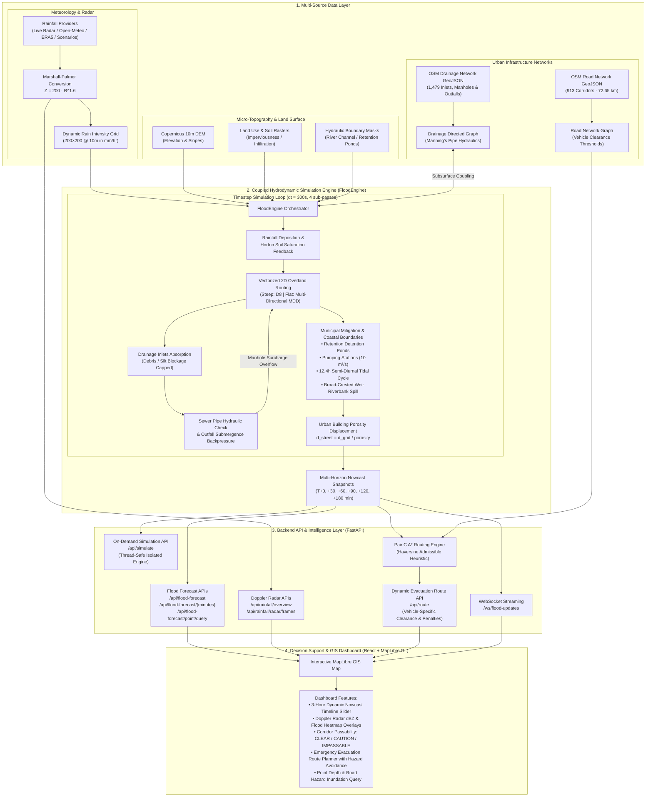

# URBAN FLOOD NOWCAST — Repository Structure & Architecture

## Data Flow Pipeline



<p align="center">
  
</p>

---

## Coupled Multi-Pair Architecture & Shared Interface Contracts

```mermaid
flowchart LR
    subgraph PAIR_A["PAIR A: Drainage Network & Hydraulics"]
        direction TB
        DG_INIT["DrainageGraph (NetworkX DiGraph)<br/>1,479 Inlets, Manholes & Outfalls<br/>1,316 Conduit Segments"]
        MANNING["Manning's Pipe Conveyance<br/>Q = (1/n) · A · R^(2/3) · S^(1/2)"]
        INLET["Curb Inlets & Catch Basins<br/>(35% Silt/Debris Blockage)"]
        SURCHARGE_CALC["Sewer Surcharge &<br/>Manhole Boil-up Logic"]
        
        DG_INIT --> MANNING
        MANNING --> INLET
        INLET --> SURCHARGE_CALC
    end

    subgraph PAIR_B["PAIR B: 2D Flood Hydrodynamics & Nowcasting Engine"]
        direction TB
        RADAR_IN["Rainfall Nowcast Provider<br/>(Radar Marshall-Palmer Z-R<br/>& Convective Disaggregation)"]
        HYDRO_CORE["Vectorized 2D Flow Routing<br/>(D8 Steep + MDD Flat Basin<br/>with CFL Stability Check)"]
        HORTON["Horton Soil Saturation<br/>Infiltration Store (Scap)"]
        MUNICIPAL["Municipal Infrastructure Coupling<br/>• 25,000 m³ Detention Basins<br/>• 10 m³/s Pump Stations<br/>• 12.4h Semi-Diurnal Tides<br/>• Broad-Crested Weir Spill"]
        POROSITY_CALC["Building Volume Porosity<br/>d_street = d_grid / phi"]
        
        RADAR_IN --> HYDRO_CORE
        HORTON --> HYDRO_CORE
        HYDRO_CORE --> MUNICIPAL
        MUNICIPAL --> POROSITY_CALC
    end

    subgraph PAIR_C["PAIR C: Road Graph & Dynamic Evacuation Routing"]
        direction TB
        ROAD_GRAPH["Road Network Graph<br/>913 OSM Road Corridors · 72.65 km<br/>(Lanes, Widths & Road Classes)"]
        HAZARD_EVAL["Corridor Passability Classifier<br/>• CLEAR: < 10 cm<br/>• CAUTION: 10 - 30 cm<br/>• IMPASSABLE: > 30 cm"]
        ASTAR["Dynamic Flood-Aware A* Routing<br/>Admissible Haversine Time Heuristic<br/>Thread-Safe Zero-Copy Subgraph Views"]
        VEHICLES["Multi-Tier Clearance Thresholds<br/>• Pedestrian (15 cm) | Car (30 cm)<br/>• SUV / Ambulance (45 cm) | Truck (60 cm)"]
        
        ROAD_GRAPH --> HAZARD_EVAL
        HAZARD_EVAL --> ASTAR
        VEHICLES --> ASTAR
    end

    subgraph DELIVERY["FastAPI Services & Live MapLibre Dashboard"]
        direction TB
        API_LAYER["FastAPI REST & WebSocket Layer<br/>• /api/flood-forecast<br/>• /api/rainfall/radar<br/>• /api/route<br/>• /api/simulate"]
        FRONTEND_DASH["Interactive Web GIS Dashboard<br/>• Heatmap & Radar Reflectivity Overlays<br/>• Multi-Horizon Slider (0 to 180 min)<br/>• Hazard-Penalized Evacuation Paths<br/>• Passability & Chokepoint Alerts"]
        
        API_LAYER --> FRONTEND_DASH
    end

    %% INTERFACE CONTRACTS
    HYDRO_CORE -- "absorb_surface_water(depth_grid, dt)<br/>[Water deducted from surface]" --> INLET
    SURCHARGE_CALC -- "compute_overflow()<br/>[Surcharged water added back to grid]" --> HYDRO_CORE
    MUNICIPAL -- "set_river_submergence(river_stage, depth_grid)<br/>[Drowned outfall backpressure]" --> SURCHARGE_CALC

    POROSITY_CALC -- "get_forecast_grids() & get_street_depth()<br/>[200×200 Street Water Depths @ T+0..T+180]" --> HAZARD_EVAL

    POROSITY_CALC -- "Nowcast Depth Rasters (GeoTIFF/JSON)" --> API_LAYER
    ASTAR -- "Safe Evacuation Polyline & ETA" --> API_LAYER
```



---

## Repository Tree

```
urbanFlood/
│
├── backend/                          # Python backend (FastAPI)
│   ├── app/
│   │   ├── __init__.py
│   │   ├── main.py                   # FastAPI application entry point
│   │   ├── config.py                 # All tuneable parameters & paths
│   │   ├── models/                   # Pydantic request/response schemas
│   │   │   ├── __init__.py
│   │   │   ├── flood.py              # FloodForecast, FloodCell, etc.
│   │   │   ├── drainage.py           # DrainageNode, DrainageEdge
│   │   │   ├── routing.py            # RouteRequest, RouteResponse
│   │   │   └── rainfall.py           # RainfallScenario, NowcastFrame
│   │   ├── api/                      # Route handlers
│   │   │   ├── __init__.py
│   │   │   ├── flood.py              # /api/flood-forecast endpoints
│   │   │   ├── drainage.py           # /api/drainage endpoints
│   │   │   ├── roads.py              # /api/roads endpoints
│   │   │   ├── simulate.py           # /api/simulate endpoint
│   │   │   ├── route.py              # /api/route endpoint
│   │   │   └── websocket.py          # /ws/flood-updates
│   │   ├── engine/                   # Core simulation logic
│   │   │   ├── __init__.py
│   │   │   ├── flood_engine.py       # FloodEngine class (main orchestrator)
│   │   │   ├── surface_flow.py       # 2D grid water routing (D8-simplified)
│   │   │   ├── drainage_network.py   # DrainageGraph — NetworkX directed graph
│   │   │   ├── rainfall_provider.py  # RainfallProvider interface + DemoProvider
│   │   │   └── routing_engine.py     # A* flood-aware route planner
│   │   ├── data/                     # Data loading & generation utilities
│   │   │   ├── __init__.py
│   │   │   ├── synthetic_city.py     # Generate entire synthetic city dataset
│   │   │   ├── dem_loader.py         # Load/generate DEM raster
│   │   │   └── geojson_loader.py     # Load GeoJSON assets
│   │   └── utils/
│   │       ├── __init__.py
│   │       ├── geo.py                # CRS helpers, coordinate transforms
│   │       └── logger.py             # Structured logging setup
│   │
│   ├── data/                         # Static / generated data assets
│   │   ├── dem/                      # DEM rasters (.npy or GeoTIFF)
│   │   ├── drainage/                 # drainage_nodes.geojson, drainage_edges.geojson
│   │   ├── roads/                    # road_network.geojson
│   │   ├── rainfall/                 # Pre-baked rainfall scenario grids
│   │   └── config/                   # scenario configs (YAML)
│   │       └── scenarios.yaml
│   │
│   ├── tests/
│   │   ├── __init__.py
│   │   ├── test_flood_engine.py
│   │   ├── test_drainage.py
│   │   ├── test_surface_flow.py
│   │   └── test_routing.py
│   │
│   ├── requirements.txt
│   ├── Dockerfile
│   └── README.md
│
├── frontend/                         # React + TypeScript + Tailwind
│   ├── public/
│   │   └── index.html
│   ├── src/
│   │   ├── main.tsx
│   │   ├── App.tsx
│   │   ├── api/                      # Axios / fetch wrappers
│   │   │   ├── floodApi.ts
│   │   │   ├── routeApi.ts
│   │   │   └── websocket.ts
│   │   ├── components/
│   │   │   ├── MapView.tsx           # MapLibre GL map
│   │   │   ├── FloodLayer.tsx        # Flood depth heatmap layer
│   │   │   ├── DrainageLayer.tsx     # Drainage nodes/edges overlay
│   │   │   ├── RoadLayer.tsx         # Road network + flood highlighting
│   │   │   ├── TimelineSlider.tsx    # 0 → +180 min slider
│   │   │   ├── InfoPanel.tsx         # Click popup (road / drainage info)
│   │   │   ├── RoutePlanner.tsx      # Source / destination + results
│   │   │   ├── ScenarioSelector.tsx  # Demo rainfall scenario picker
│   │   │   ├── Legend.tsx            # Flood depth colour legend
│   │   │   └── StatsBar.tsx          # Top-bar KPI cards
│   │   ├── hooks/
│   │   │   ├── useFloodData.ts
│   │   │   ├── useWebSocket.ts
│   │   │   └── useRouting.ts
│   │   ├── types/
│   │   │   └── index.ts              # Shared TypeScript interfaces
│   │   ├── utils/
│   │   │   ├── colors.ts             # Flood depth → colour mapping
│   │   │   └── geo.ts                # GeoJSON helpers
│   │   └── styles/
│   │       └── globals.css           # Tailwind directives + custom vars
│   ├── tailwind.config.js
│   ├── tsconfig.json
│   ├── vite.config.ts
│   ├── package.json
│   └── Dockerfile
│
├── docker-compose.yml                # Orchestrate backend + frontend + (optional PostGIS)
└── README.md                         # Top-level overview
```

---

## Module Responsibilities

### `engine/flood_engine.py` — `FloodEngine`
The central orchestrator. Holds the DEM grid, rainfall grid, drainage graph, and water-depth grid.

| Method | Purpose |
|--------|---------|
| `__init__(dem, rainfall_grid, drainage_network)` | Store references, allocate depth grid |
| `initialize()` | Zero-out depth, pre-compute flow directions from DEM |
| `apply_rainfall(timestep_s)` | Add `rain_rate × dt × (1 - infiltration)` to each cell |
| `calculate_surface_flow()` | Redistribute water from high → low cells (simplified D8) |
| `calculate_drainage_absorption()` | Remove water from cells that sit over drainage inlets (up to inlet capacity) |
| `calculate_overflow()` | Push excess back to surface when pipe capacity exceeded |
| `simulate_timestep(dt)` | Call the above four in sequence |
| `run_forecast(horizon_minutes, dt)` | Loop `simulate_timestep` and collect snapshots at +30/+60/+90/+120/+180 min |

### `engine/drainage_network.py` — `DrainageGraph`
Wraps a `networkx.DiGraph`. Each node/edge carries the attributes listed in the spec. Key methods:

| Method | Purpose |
|--------|---------|
| `load_from_geojson(nodes_path, edges_path)` | Build graph from GeoJSON files |
| `get_node(id)` | Return node dict |
| `absorb_surface_water(cell_flows)` | Accept inflow at inlet nodes, propagate through graph |
| `compute_overflow()` | Return dict `{node_id: overflow_m3s}` for nodes exceeding capacity |
| `set_blockage(node_id, pct)` | Dynamically change blockage for demo scenarios |

### `engine/rainfall_provider.py` — `RainfallProvider`
Abstract base with two implementations:

| Class | Purpose |
|-------|---------|
| `RainfallProvider` (ABC) | Defines `get_current_rainfall()`, `get_radar_frames()`, `generate_nowcast()` |
| `DemoRainfallProvider` | Returns deterministic synthetic grids for 5 named scenarios |
| `LiveRainfallProvider` | (Stub) Fetches from an external API (IMD, IMERG, etc.) |

### `engine/routing_engine.py` — `RoutingEngine`
Loads OSM-style road GeoJSON into a NetworkX graph. Applies flood-depth penalties to edge weights.

| Method | Purpose |
|--------|---------|
| `load_roads(geojson_path)` | Build road graph with `length` weights |
| `apply_flood_weights(depth_grid)` | Adjust weights based on predicted depth at each road segment midpoint |
| `find_route(src, dst, vehicle_type)` | A* search → returns polyline, time, risk score, avoided roads |

### `data/synthetic_city.py`
Generates a self-contained sample city (≈ 2 km × 2 km) with:
- Gaussian-hill DEM (200 × 200 grid, 10 m cells)
- 120 road segments forming a grid + diagonals
- 50 drainage nodes (inlets, manholes, junctions, outlets)
- 60 drainage edges (pipes with varying diameters)
- 5 rainfall scenario grids

---

## Key Design Decisions

| Decision | Rationale |
|----------|-----------|
| **Grid-based simulation, not mesh/FEM** | Fast enough for real-time demo; scientifically reasonable for shallow overland flow |
| **Simplified D8 flow, not full shallow-water** | Runs in < 1 s per timestep on a 200×200 grid; avoids Navier-Stokes complexity |
| **NetworkX for drainage + routing** | Pure Python, no external DB dependency for the MVP; easy to serialize |
| **GeoJSON for all vector data** | Universal, renderable by MapLibre/Leaflet, easy to generate synthetically |
| **NumPy arrays for raster grids** | Fast vectorised arithmetic, trivial to convert to heatmap tiles |
| **WebSocket for live updates** | Lets the dashboard animate flood progression without polling |
| **Demo mode as default** | Hackathon demo works instantly without external APIs or databases |

---

## Phase Execution Summary

| Phase | What Gets Built | Key Files |
|-------|-----------------|-----------|
| 1 | Project structure, configs, empty modules, requirements | All `__init__.py`, `config.py`, `requirements.txt` |
| 2 | Synthetic city dataset generator | `synthetic_city.py`, GeoJSON + DEM files |
| 3 | Terrain model + surface water simulation | `flood_engine.py`, `surface_flow.py` |
| 4 | Drainage graph model | `drainage_network.py` |
| 5 | Coupled surface ↔ drainage simulation | `flood_engine.py` (integrate drainage) |
| 6 | FastAPI backend (all REST endpoints) | `api/*.py`, `models/*.py`, `main.py` |
| 7 | Routing engine | `routing_engine.py`, `api/route.py` |
| 8 | React GIS dashboard | All `frontend/src/**` |
| 9 | WebSocket real-time updates | `api/websocket.py`, `useWebSocket.ts` |
| 10 | Polished UI, demo scenarios, final testing | UI polish, `scenarios.yaml`, tests |

---

**Ready to proceed?** Once you approve this structure, I will begin **Phase 1**: creating every directory, empty module, config file, and dependency list so the skeleton compiles and the test runner finds all packages.
