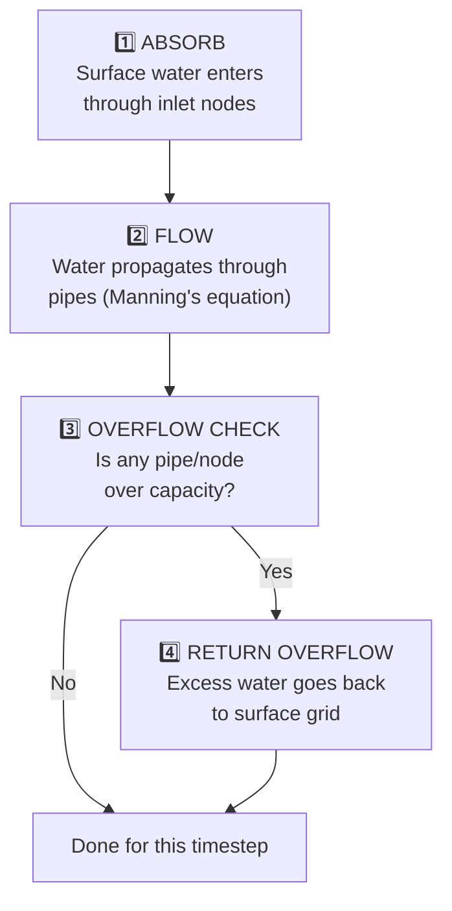

# 🔧 DrainageGraph Model — Full Explanation

## What Is the "Model" Exactly?

It's **not** a machine learning model. It's a **physics-based simulation** — a Python class that:

1. Loads your drainage GeoJSONs into a **directed graph** (NetworkX)
2. Simulates **water flowing through pipes** using real hydraulic equations
3. Tells the FloodEngine: "I absorbed X liters from the surface" and "Y liters overflowed back"

Think of it like a virtual plumbing system. Water enters through inlets on the street, flows downhill through pipes, and exits at outfalls. If too much water comes in, the pipes overflow.

---

## How It Works — The 4-Step Loop

Every 5 minutes (300 seconds) of simulated time, your DrainageGraph does this:



The FloodEngine (Pair B) calls your model every timestep:
```
FloodEngine loop:
  1. Add rainfall to surface          ← Pair B does this
  2. Calculate surface flow            ← Pair B does this
  3. drainage.absorb_surface_water()   ← YOUR MODEL
  4. drainage.compute_overflow()       ← YOUR MODEL
  5. Add overflow back to surface      ← Pair B does this
  6. Repeat for next timestep
```

---

## What Each Method Does (and How to Code It)

### Step 1: `__init__()` + `load_from_geojson()`

**What it does:** Reads your two GeoJSON files and builds a NetworkX directed graph.

**Conceptually:**
- Each **node** in the GeoJSON becomes a **node** in the graph (with attributes like capacity, elevation, type)
- Each **edge** in the GeoJSON becomes a **directed edge** (pipe) pointing from `from_node` → `to_node`

```python
import networkx as nx
import json
import numpy as np

class DrainageGraph:
    def __init__(self, nodes_path: str, edges_path: str):
        self.graph = nx.DiGraph()
        self.node_data = {}     # {node_id: {type, elevation, capacity, grid_row, grid_col}}
        self.edge_data = {}     # {edge_id: {from, to, diameter, slope, roughness, blockage}}
        self.current_flow = {}  # {node_id: current_volume_m3} — tracks water in system
        
        self._load_from_geojson(nodes_path, edges_path)
    
    def _load_from_geojson(self, nodes_path, edges_path):
        # Load nodes
        with open(nodes_path) as f:
            nodes_geojson = json.load(f)
        
        for feature in nodes_geojson["features"]:
            props = feature["properties"]
            node_id = props["id"]
            self.graph.add_node(node_id, **props)
            self.node_data[node_id] = props
            self.current_flow[node_id] = 0.0   # starts empty
        
        # Load edges
        with open(edges_path) as f:
            edges_geojson = json.load(f)
        
        for feature in edges_geojson["features"]:
            props = feature["properties"]
            self.graph.add_edge(props["from_node"], props["to_node"], **props)
            self.edge_data[props["id"]] = props
```

> [!NOTE]
> This is just reading JSON and building a graph data structure. No physics yet.

---

### Step 2: Manning's Equation — `compute_pipe_capacity()`

**What it does:** For each pipe, calculates the **maximum flow rate** (m³/s) it can carry.

**The physics:** Manning's equation is a standard civil engineering formula for open-channel/pipe flow:

```
Q = (1/n) × A × R^(2/3) × S^(1/2)

Where:
  Q = flow rate (m³/s)
  n = roughness coefficient (0.013 for concrete, 0.025 for earth channels)
  A = cross-sectional area of pipe = π × (D/2)²
  R = hydraulic radius = D/4 (for a full circular pipe)
  S = slope of the pipe (dimensionless, e.g., 0.005)
  D = diameter of the pipe (meters)
```

```python
import math

def compute_pipe_capacity(self, edge_id: str) -> float:
    """Returns max flow rate in m³/s for a pipe."""
    edge = self.edge_data[edge_id]
    
    D = edge["diameter_m"]
    n = edge["roughness_n"]
    S = edge["slope"]
    blockage = edge.get("blockage_pct", 0.0)
    
    A = math.pi * (D / 2) ** 2          # cross-section area
    R = D / 4                            # hydraulic radius (full pipe)
    
    Q = (1 / n) * A * R ** (2/3) * S ** 0.5   # Manning's formula
    Q_effective = Q * (1 - blockage)      # reduce by blockage percentage
    
    return Q_effective
```

> [!NOTE]
> **Why Manning's?** It's the industry standard for drainage design. Your pipe data already has `diameter_m`, `slope`, and `roughness_n` — these are exactly the inputs Manning's needs. No training data required; it's deterministic physics.

---

### Step 3: `absorb_surface_water(depth_grid, dt)`

**What it does:** Looks at every **inlet node**, checks how much water is sitting on the surface at that grid cell, and "sucks" some of it into the drainage system.

**The logic:**
- For each inlet node, find its `(grid_row, grid_col)` on the DEM
- Look up `depth_grid[row, col]` — this is how deep the surface water is (in meters)
- The inlet can absorb at most `capacity_m3s × dt` cubic meters per timestep
- It can also absorb at most all the water sitting on the surface at that cell
- Take the minimum → that's how much gets absorbed

```python
def absorb_surface_water(self, depth_grid: np.ndarray, dt: float) -> np.ndarray:
    """
    Args:
        depth_grid: (200, 200) array of surface water depth in meters
        dt: timestep in seconds (e.g., 300 for 5 minutes)
    
    Returns:
        absorption_grid: (200, 200) array — how much water (m) removed from each cell
    """
    cell_area = 10.0 * 10.0  # 100 m² per cell
    absorption_grid = np.zeros_like(depth_grid)
    
    for node_id, node in self.node_data.items():
        if node["type"] != "inlet":
            continue
        
        row, col = node["grid_row"], node["grid_col"]
        surface_water_m = depth_grid[row, col]
        
        if surface_water_m <= 0:
            continue
        
        # Max the inlet can take in this timestep
        max_absorb_volume = node["capacity_m3s"] * dt        # m³
        max_absorb_depth = max_absorb_volume / cell_area      # convert to meters of depth
        
        # Actually absorb the lesser of what's available vs capacity
        absorbed_depth = min(surface_water_m, max_absorb_depth)
        absorption_grid[row, col] += absorbed_depth
        
        # Track water entering the system
        self.current_flow[node_id] += absorbed_depth * cell_area  # m³
    
    return absorption_grid
```

> [!IMPORTANT]
> The FloodEngine (Pair B) will call this and subtract the result from its `water_depth` grid:
> ```python
> absorbed = drainage.absorb_surface_water(water_depth, dt=300)
> water_depth -= absorbed
> ```

---

### Step 4: Pipe Flow Propagation

**What it does:** Once water enters the system through inlets, it flows **downhill through the pipe network** from node to node.

**The logic:**
- Do a **topological sort** of the graph (upstream nodes first)
- For each node, push its water to downstream neighbors
- The amount pushed is limited by the pipe's Manning capacity

```python
def propagate_flow(self, dt: float):
    """Move water through the pipe network for one timestep."""
    try:
        sorted_nodes = list(nx.topological_sort(self.graph))
    except nx.NetworkXUnfeasible:
        sorted_nodes = list(self.graph.nodes())  # fallback if cycles exist
    
    for node_id in sorted_nodes:
        available_water = self.current_flow.get(node_id, 0.0)
        if available_water <= 0:
            continue
        
        # Get all outgoing pipes
        out_edges = list(self.graph.out_edges(node_id, data=True))
        if not out_edges:
            continue  # outfall node — water leaves the system
        
        # Distribute water proportionally to pipe capacities
        total_capacity = 0
        edge_caps = []
        for u, v, data in out_edges:
            cap = self.compute_pipe_capacity(data["id"])
            max_flow = cap * dt  # m³ this pipe can move in this timestep
            edge_caps.append((v, data["id"], max_flow))
            total_capacity += max_flow
        
        for downstream_node, edge_id, max_flow in edge_caps:
            if total_capacity > 0:
                share = max_flow / total_capacity
                transferred = min(available_water * share, max_flow)
                self.current_flow[downstream_node] = self.current_flow.get(downstream_node, 0.0) + transferred
                self.current_flow[node_id] -= transferred
```

---

### Step 5: `compute_overflow()`

**What it does:** Checks every node — if the water accumulated there exceeds the node's capacity, the excess **overflows back to the surface**.

```python
def compute_overflow(self) -> dict:
    """Returns {node_id: overflow_volume_m3} for nodes exceeding capacity."""
    overflow = {}
    
    for node_id, node in self.node_data.items():
        current = self.current_flow.get(node_id, 0.0)
        max_capacity = node["capacity_m3s"] * 300  # capacity over one timestep
        
        if current > max_capacity:
            excess = current - max_capacity
            overflow[node_id] = excess
            self.current_flow[node_id] = max_capacity  # cap it
    
    return overflow
```

The FloodEngine then puts that overflow back on the surface:
```python
overflow = drainage.compute_overflow()
for node_id, volume in overflow.items():
    row, col = drainage.get_node_cell(node_id)
    water_depth[row, col] += volume / cell_area  # m³ → meters of depth
```

---

## Will It Work for Any Data or Only Mumbai?

### Short Answer
**The model logic is general-purpose. The data is Mumbai-specific. Making it work for another city is easy — you just swap the data files.**

### What's General (works anywhere):
| Component | Why It's General |
|---|---|
| Manning's equation | Universal physics — works for any pipe anywhere |
| Absorption logic | Just reads `capacity_m3s` from GeoJSON — doesn't care which city |
| Topological flow propagation | Works on any directed graph |
| Overflow detection | Compares flow vs capacity — city-agnostic |
| GeoJSON loading | Reads any file following your schema |

### What's Mumbai-Specific (needs updating for another city):

| Hardcoded Value | Where | To Generalize |
|---|---|---|
| `GRID_ROWS = 200`, `GRID_COLS = 200` | Multiple files | Move to a shared `config.py` |
| `CELL_SIZE_M = 10.0` | Multiple files | Move to `config.py` |
| Bounding box (`19.06, 72.85...`) | [`clean_drainage.py`](file:///c:/Users/aksha/urbanFlood/backend/data/drainage/clean_drainage.py), [`fetch_real_roads.py`](file:///c:/Users/aksha/urbanFlood/backend/data/roads/fetch_real_roads.py) | Make configurable |
| DEM `.npy` file | [`process_dem.py`](file:///c:/Users/aksha/urbanFlood/backend/data/dem/process_dem.py) | Re-run with new city's DEM |
| Drainage GeoJSONs | `backend/data/drainage/` | Re-run data pipeline for new city |

### For the Demo:
During the hackathon demo, it will run on **the Mumbai 2×2 km patch** because that's the data you've collected. But if a judge asks "does this work for Delhi?", you can honestly say:

> *"The simulation engine is city-agnostic. We swap in a new DEM, drainage network, and road network for any city, and the same physics runs. We demonstrated on Mumbai because we had verified data for it."*

To actually prove it, you'd need ~2-3 hours to:
1. Run the Overpass query with Delhi coordinates
2. Get a Delhi DEM from OpenTopography
3. Re-run your existing scripts (`process_dem.py`, `clean_drainage.py`, `fetch_real_roads.py`)

The **model code doesn't change at all** — only the input data files.

---

## Summary — Your Coding Checklist

```
DrainageGraph class:
├── __init__() + load_from_geojson()     → Load JSON into NetworkX graph
├── compute_pipe_capacity(edge_id)       → Manning's equation (pure math)
├── absorb_surface_water(depth_grid, dt) → Inlets suck water from surface
├── propagate_flow(dt)                   → Water moves through pipes
├── compute_overflow()                   → Detect overfull nodes
├── set_blockage(edge_id, pct)           → Simple setter for Scenario 5
├── get_node_cell(node_id)               → Return (row, col) tuple
├── get_node(node_id)                    → Return full attribute dict
└── get_edge(edge_id)                    → Return full attribute dict
```

None of these methods use ML, training data, or anything that needs to "learn." It's all deterministic physics + graph algorithms. Give it the same inputs → get the same outputs every time.
